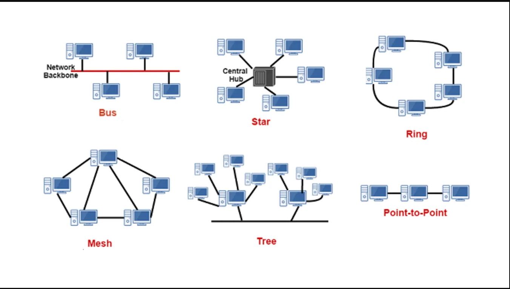
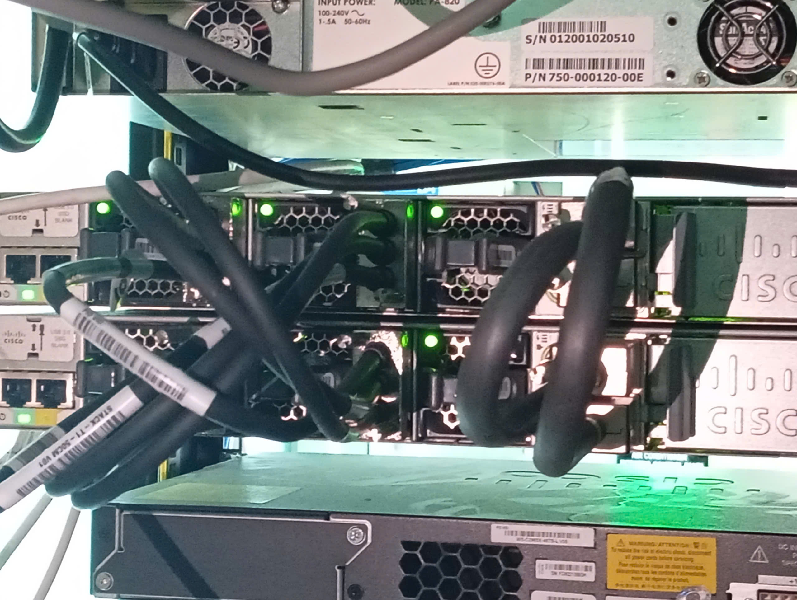
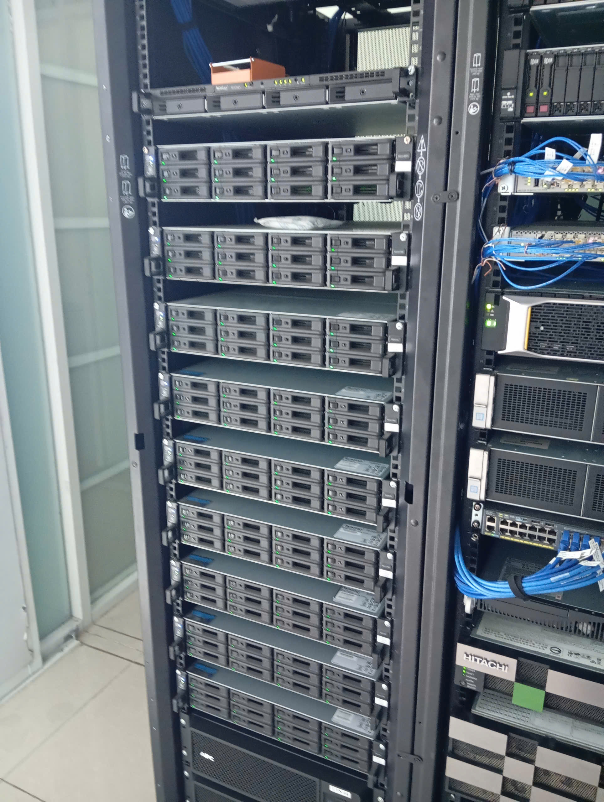
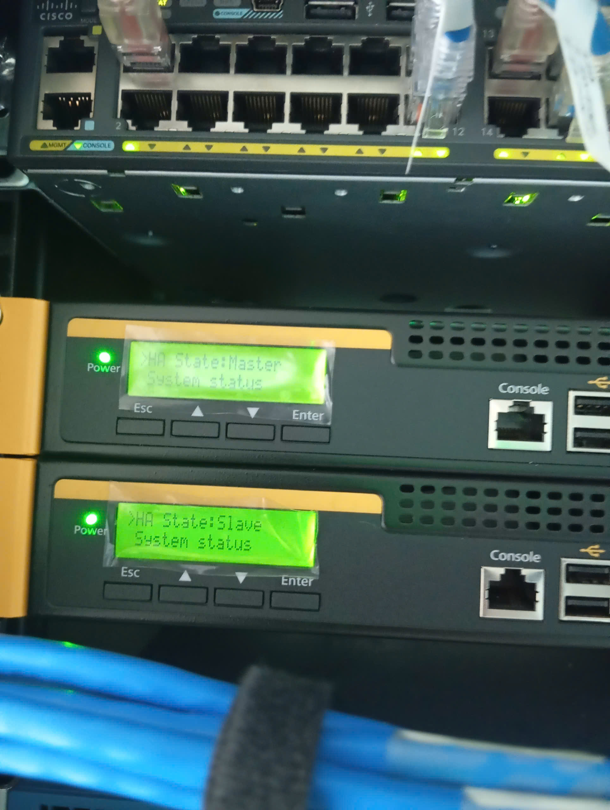
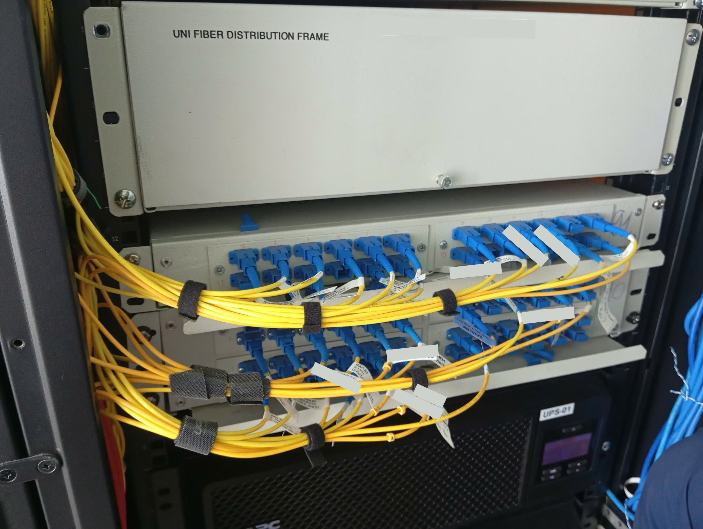

## **Lời cảm ơn**
Qua quá trình học tập và rèn luyện tại trường Đại học Công nghệ Thông tin để trau dồi kiến thức và kĩ năng, em nhận được rất nhiều sự quan tâm, giúp đỡ của quý thầy cô, gia đình và bạn bè. Với lòng biết ơn sâu sắc nhất, em muốn cảm ơn đến nhà trường, thầy cô Khoa Mạng máy tính và Truyền thông dữ liệu đã truyền đạt vốn kiến thức nền tảng cho em trong suốt quá trình học tập.

Em xin gửi lời cảm ơn chân thành đến thầy Lê Anh Tuấn - người đã theo dõi sát sao và tận tình trong quá trình hướng dẫn cũng như bổ sung và sửa chữa những sai sót trong quá trình thực hiện báo cáo thực tập.

Bên cạnh đó, em cũng gửi lời cảm ơn sâu sắc đến ban lãnh đạo và toàn thể anh/ chị công nhân viên của công ty dã tạo điều kiện để em có cơ hội được thực tập trong một môi trường chuyên nghiệp và năng động. Nhờ sự chỉ dẫn và giúp đỡ tận tình của anh [] cùng với các anh/chị đồng nghiệp... em đã tiếp thu được rất nhiều kiến thức quan trọng về quản trị mạng, quản lý hạ tầng mạng cũng như học được rất nhiều các kĩ năng quan trọng trong vị trí là một Chuyên viên quản trị mạng máy tính.

## **Lý do chọn đề tài**
Theo báo cáo tình hình an toàn thông tin trong nước 6 tháng đầu năm 2024, tình hình an toàn thông tin toàn cầu tiếp tục diễn biến phức tạp và đáng lo ngại. Các cuộc tấn công đang gia tăng cả về mức độ số lượng và cả mức độ tinh vi, nhắm vào rất nhiều các cơ quan chính phủ, doanh nghiệp và các tổ chức cá nhân.

VNPT ghi nhận xu hướng tấn công mã hóa dữ liệu  với mục đích tống tiền các doanh nghiệp (ransomware attack) tăng cao đáng báo động. Số lượng các cuộc tấn công trên toàn thế giới đã tăng gấp 1,3 lần so với cùng kỳ 2023, riêng khu vực Việt Nam đã tăng gần gấp 2 lần và để lại nhiều ảnh hưởng nghiêm trọng đến cả uy tín, tài sản của nhiều doanh nghiệp, tổ chức. Số lượng các cuộc tấn công mạng tại Việt Nam tăng hơn 60% so với năm 2023. Số lượng mã độc mới được phát triển đãng tăng hơn 52%, các nhóm tin tặc với mục đích tài chính có nhiều kỹ thuật và thủ đoạn mới, các chiến dịch cũng có sự đầu tư hơn tiêu biểu như các nhóm GoldFactory, Ducktail.

Các lỗ hổng mới năm 2024 gia tăng 64,33% so với với cùng kỳ năm 2023, đặc biệt số lượng các lỗ hổng có mức độ nghiêm trọng cao cũng tăng cao. Tuy vậy số lượng lỗ hổng 0day bị khai thác ngoài tự nhiên đã giảm khoảng 50%. Trong số đó các hạ tầng thường tồn tại các lỗ hổng Security Misconfiguration ~28,05%, XSS và Broken Access Control (BAC) hơn 19%, tỉ lệ này không thay đổi nhiều so với năm 2023. [1]

Trước những biến động khó lường của tình hình tấn công mạng cũng như sự phát triển của khoa học công nghệ đòi hỏi các tổ chức và doanh nghiệp luôn phải sẵn sàng cho việc đảm bảo an toàn thông tin nội bộ doanh nghiệp và thông tin của khách hàng. 

Thời gian thực tập ở doanh nghiệp, em mong muốn xây dựng được một góc nhìn toàn diện và đầy đủ về tình hình triển khai một hệ thống mạng, nhằm đảm bảo đáp ứng nhu cầu sử dụng mạng và an toàn thông tin trong doanh nghiệp.
## **Danh mục hình ảnh**

// Danh mục hình ảnh

## **Danh mục bảng**

// Danh mục bảng 

# **Chương 1**. GIỚI THIỆU CHUNG

### 1. **Giới thiệu đơn vị thực tập**

#### 1.1. Giới thiệu chung

Tên công ty: Công ty Cổ phần Giải pháp CNTT Tân Cảng, tiền thân là phòng CNTT thuộc Tổng Công ty Tân Cảng Sài Gòn (Saigon Netport Coporation - SNP)

Được thành lập năm 1996, trải qua 28 năm hoạt động, phòng CNTT Tân Cảng Sài Gòn đã thực hiện thành công các ứng dụng CNTT trong quản lý, điều hành của Tổng công ty. Nổi bật là việc tích hợp và triển khai thành công phần mềm điều hành và khai thác cảng TOPX (RBS Úc) kết nối với phần mềm quản lý container CMS, qua đó tự động hóa việc điều hành khai thác cảng, tăng năng suất giải phóng tàu, giảm thời gian giao nhân container. Nghiên cứu và phát triển ứng dụng thành công phần mềm quản lý kho CFS mới, áp dụng CNTT trong quản lý vật tư, quản lý tài chính, lao động, quản lý tiền lương; triển khai các ứng dụng giá trị gia tăng như tra cứu thông tin về container qua tin nhắn điện thoại di động (SMS), qua website; qua ứng dụng truyền nhận số liệu EDI với các hãng tàu ... đã không ngừng nâng cao chất lượng dịch vụ của Tổng công ty. 

Với những kết quả đã đạt được trong ứng dụng CNTT vào hoạt động quản lý, điều hành khai thác cảng, Tổng Công ty TCSG đã là cảng tiên phong ứng dụng thành công tin học hóa trong điều hành sản xuất ở quy mô lớn, khẳng định và giữ vững uy tín thương hiệu, vị thế là nhà khai thác cảng container chuyên nghiệp, hiện đại và lớn nhất Việt Nam. Đặc biệt, thương hiệu Tân Cảng Sài Gòn trở thành Thương hiệu Quốc gia và Cảng Cát Lái  hiện đứng trongTop 40 cảng container hàng đầu thế giới.

Nhằm đáp ứng yêu cầu nghiên cứu, ứng dụng, triển khai có hiệu quả các giải pháp CNTT trong lĩnh vực khai  thác cảng biển, ngày 15/11/2010, Tổng công ty Tân Cảng Sài Gòn đã quyết định thành lập Công ty Cổ phần Giải pháp CNTT Tân Cảng (TCIS). Với đội ngũ nhân sự chất lượng lượng cao, được đào tạo cơ bản và thường xuyên huấn luyện nâng cao từ các hãng Microsoft, Oracle, Cisco, SUN...cùng với kinh nghiệm qua 15 năm thực hiện thành công các ứng dụng và giải pháp công nghệ thông tin tại Tổng Công ty, TCIS đã và đang hướng đến mục tiêu trở thành nhà cung cấp dịch vụ, giải pháp CNTT chuyên nghiệp, chất lượng và uy tín hàng đầu trong lĩnh vực khai khác cảng biển, kho bãi, hậu cần, dây chuyền cung ứng.... 

#### 1.2. Hoạt động kinh doanh:
- Liên kết, hợp tác chiến lược với các đối tác để xây dựng các ứng dụng CNTT theo tiêu chuẩn quốc tế;
- Tư vấn phân tích, thiết kế và triển khai tích hợp các hệ thống thông tin quản lý doanh nghiệp và các hệ thống quản lý trong lĩnh vực cảng biển, kho bãi, hậu cần dây chuyền cung ứng…
- Cung cấp và cho thuê các thiết bị CNTT, thiết bị chuyên dụng trong lĩnh vực cảng biển, kho bãi, dây chuyền cung ứng…;
- Quản lý, vận hành hệ thống CNTT;
- Tư vấn, huấn luyện đào tạo về CNTT;
- Xử lý, cho thuê dữ liệu;
- Cung ứng nguồn nhân lực CNTT trong và ngoài nước.

#### 1.3. Thông tin liên lạc;
- Trụ sở chính: 722 Điện Biên Phủ, P.22, Q. Bình Thạnh, TP.HCM
- Số điện thoại: (84 -24)3 747 6666
- Fax: 3512 4049  

### 2. **Giới thiệu vị trí thực tập**
- Vị trí thực tập: nhân viên quản lý mạng máy tính.

### 3. Kế hoạch thực tập
#### 3.1. Thời gian thực tập
- Thời gian bắt đầu: 22/7/2024
- Thời gian kết thúc: 30/9/2024
#### .2. Các giai đoạn thực tập*
- *Giai đoạn 1 Thời gian: Từ 22/7 đến 5/8*: Nghiên cứu chuyên sâu các kiến thức  
- *Giai đoạn 2 Thời gian: Từ 6/8 đến 19/8*: Tìm hiểu và làm quen với một số platform mà doanh nghiệp sử dụng
- *Giai đoạn 3 Thời gian: Từ 19/8 đến 26/8*: Nghiên cứu cơ cấu mạng doanh nghiệp
- *Giai đoạn 4 Thời gian: Từ 27/8 đế 9/9*: Các công việc thực tế tại doanh nghiệp
- *Giai đoạn 5 Thời gian: Từ 9/9 đến 23/9*: Viết báo cáo thực tập doanh nghiệp

# **Chương 2**. NGHIÊN CỨU LÝ THUYẾT
**I. KIẾN THỨC NỀN TẢNG**
### 1. Hệ thống mạng:
#### 1.1. Tổng quan về mạng máy tính
- **Mạng máy tính (Computer Network)**: là mạng viễn thông kĩ thuật số được sử dụng để kết nối nhiều máy tính với nhau thông qua các thết bị kết nối mạng và phương tiện truyền thông (Giao thức mạng, môi trường truyền dẫn) bằng một cấu trúc và các máy tính trong mạng có thể trao đổi thông tin với nhau.
- **Quản trị mạng máy tính (Network Administration)**: Là công việc nhuawmf quản lý, giám sát và duy trì, bảo mật và phục vụ mạng cho một tổ chức. Tuy nhiên, các nhiệm vụ và thủ tục cụ thể có thể sẽ tùy thuộc vào quy mô và mô hình của tổ chức.
- **Các công việc của quản trị mạng máy tính:** bao gồm giám sát mạng, duy trì chất lượng và bảo mật mạng. Giám sát là điều cần thiết để theo dõi các lưu lượng mạng truy cập bất thường, theo dõi tình trạng cơ sở hạ tầng và các thiết bị được kết nối mạng.

Bên cạnh đó, quản trị mạng có thể phát hiện sớm các hoạt động bất thường, các sự cố phát sinh để có thể ngăn ngừa, duy trì và khắc phục chất lượng, đảm bảo mạng thông suốt và liên tục. 

Quản lý mạng bao gồm nhiều chức năng quản trị, gồm lập kế hoạch, triển khai và cấu hình mạng, cụ thể như sau:
- Quy hoạch lại mạng dựa trên các yêu cầu thay đổi của tổ chức.
- Triển khai mạng để đạt hiệu quả cao
- Cáu hình các giao thức mạng và các giao thức bảo mật mạng khác nhau.
- Áp dụng các bản vá bảo mật và cập nhật chương trình cơ sở của hạ tầng mạng, chẳng hạn như bộ định tuyến, bộ tập trung, bộ chuyển mạch và tường lửa. 
- Đánh giá điểm yếu của mạng.
- Đánh giá chất lượng và dung lượng để tăng hoặc giảm dung lượng mạng, quản lý tránh lãng phí tài nguyên.
#### 1.2. Kiến trúc OSI/ISO

Mô hình OSI (Open System Inteconnection Reference Model) - Tạm dịch là mô hình tham chiếu kết nối các hệ thống mở, hay còn gọi là mô hình 7 tầng OSI. 

Mô hình này là mô tả 7 tầng của một hệ thống mạng máy tính sử dụng để giao tiếp qua mạng. Đây là mô hình đầu tiên trong truyền thông mạng, được tất cả các công ty máy tính và viễn thông lớn trên thế giới sử dụng 

**Tại sao mô hình này lại quan trọng?**
- *Hiểu biết chung về những hệ thống phức tạp*: Nó giúp các kĩ sư có thể tổ chức và mô hình hóa kiến trúc mạng của các hệ thống mạng phức tạp. Bằng cách chia lớp dựa trên các chức năng chính, nó giúp quản lý và hiểu biết hệ thống một cách rõ ràng.
- *Nghiên cứu và chuẩn hóa nhanh hơn*: Khi xây dựng một hệ thống mới, kĩ sư có thể hiểu rõ công việc của mình thông qua mô hình OSI. Điều này giúp họ phát triển công nghệ cần thiết để tạo ra được một thệ thống mạng hoạt động một cách hiệu quả. Đồng thời tạo điều kiện để phát triển cũng như sửa lỗi hệ thống nhanh chóng bằng cách chuẩn hóa các quy trình và giao thức đẫ được chuẩn hóa.
#### 1.3. Tìm hiểu về mạng LAN
##### 1.3.1. Những yếu tố cơ bản cấu tạo nên hệ thống mạng LAN
- Những yếu tố chính cấu thành nên mạng LAN, bao gồm:
+ **Máy trạm (workstation) trong mạng LAN**: Bao gồm các thiết bị máy tính xách tay, PC, máy tính bảng, điện thoại di động... và các thiết bị này sẽ được kết nối vào mạng LAN để có thể truy cập các nguồn tài nguyên và liên lạc với các thiết bị khác trong mạng.
LAN (Local Area Network) là một hệ thống mạng máy tính cho phép các thiết bị kết nối và giao tiếp với nhau nhằm chia sẻ dữ liệu. 
+ **Card giao tiếp mạng (Network Interface Card - NIC) và drive**: đây là một phần cứng được cài vào máy tính để kết nối với mạng LAN, đồng thời một phần mềm driver cần được cài đặt trên hệ điều hành để quản lý hoạt động của card mạng này.
+ **Vai trò của Switch trong mạng LAN**: Switch là thiết bị chuyển mạch dữ liệu, giúp kết nối máy tính và các thiết bị trong mạng LAN, chuyển tiếp tài nguyên dữ liệu từ thiết bị này sang thiết bị khác. Các loại cáp mạng có nhiều loại như cáp quang, cáp mạng Ethernet, cáp đồng trục và tùy vào công nghệ được sử dụng.
+ **Router trong mạng LAN**: Router là thiết bị mạng được sử dụng để kết nối mạng LAN và mạng WAN hoặc với các mạng khác nhau. Router còn đóng vai trò định tuyến dữ liệu, điều khiển lưu lượng giữa các mạng và quản lý lưu lượng trên mạng. Là thiết bị dùng để kết nối mạng LAN với WAN hoặc các mạng khác, có khả năng định tuyến dữ liệu và quản lý lưu lượng.
+ **Hệ điều hành trong mạng LAN**: Các Server trong mạng LAN thường chạy các hệ điều hành như windows server, linux hoặc macOS server, cung cấp các dịch vụ phù hợp để quản lý lưu lượng mạng.

**Kết nối trong mạng LAN**
Kết nối trong mạng LAN thường được thiết lập thông qua cáp mạng hoặc kết nối không dây, trong một khu vực giới hạn nhất định, đó có thể là văn phòng, nhà riêng hoặc trường học.

- LAN cho phép các thiết bị trao đổi thông tin và tài nguyên như tệp tin, máy in, và ứng dụng, tạo điều kiện cho sự hợp tác và chia sẻ trong một mội trường cục bộ.

- Phạn vi sử dụng LAN: LAN có phạm vi sử dụng hạn chế trong một khu vực như văn phòng, nhà riêng, trường học, phòng game, hoặc doanh nghiệp. Thông thường phạm vi của mạng LAN không vượt quá 100m.

- Các kiểu (Topology) trong LAN

**Các tiêu chuẩn của Wifi hiện nay**:
- **Wifi 802.11 chuẩn a/b/g/n/ac** là một chuẩn nhỏ của kết nối 802.11. Đây là một tập các chuẩn để đặc tả thông số kĩ thuật của mạng không dây do tổ chức IEEE tạo ra.
- Hoạt động trên dải băng tần 5GHz và tốc độ tối đa lên tới 1730 Mbps, Wifi 802.11 chuẩn a/b/g/n/ac sẽ giúp người dùng trải nghiệm ở mức độ truy cập internet cao nhất.
- **Chuẩn 802.11** vào năm 1997, tổ chức IEE đã giới thiệu chuẩn mạng không dây đầu tiên chuản 802.1. Tốc độ tối đa của mạng mà chuẩn 802.11 này hỗ trợ chỉ là 2 Mbps với băng tần là 2.4 GHz.
- Với sự phát triển của tốc độ truy cập internet hiện nay thì chuẩn 802.11 được xem là quá chậm nên không còn được sử dụng trên nhiều thị trường nữa.
- **Chuẩn 802.11b**: sau khoảng 2 năm giới thiệu chuẩn 802.11, IEEE tiếp tục giới thiệu một chuẩn mới với tên gọi chuẩn 802.11b với nhiều cải tiến. Cụ thể, chuẩn 802.11b hỗ trợ 11 Mbps nhưng vẫn sử dụng dải băng tần 2.4 GHz. Phạm vi kết nối của chuẩn 802.11b có thể
lên đến 150m tùy thuộc vào môi trường.
- Bởi vì vẫn sử dụng dải băng tần 2.4 GHz nên thiết bị trang bị chuẩn 802.11b là rất dễ bị nhiễu từ, đặc biệt khi đặt cạnh các thiết bị như tivi, lò vi sóng,...
- **Chuẩn 802.11a** được phát triển cùng thời gian với chuẩn 802.11b nhưng chủ yếu cho đối tượng khách hàng là doanh nghiệp thay vì đối tượng gia đình như chuẩn b, do đó chuẩn a có giá thành khá cao.
- Chuẩn 802.11a hỗ trợ tốc độ gấp gần 5 lần so với chuẩn b, tối đa lên tới 54Mpbs với băng tần vô tuyến 5GHz. Nhờ thay đổi băng tần nên chuẩn 802.11a khắc phục điểm yếu dễ nhiễu từ. Tuy nhiên, khuyết điểm của chuẩn này đó là phạm vị hoạt động bị thu hẹp lại chỉ còn từ 40 – 100m bởi tần số cao, gặp các vật cản như tường, vách thì tín hiệu khó có thể xuyên qua được.
- **Chuẩn 802.11g** được ra mắt vào năm 2003 là bản kết hợp của hai chuẩn 802.11a và chuẩn 802.11b. Chuẩn 802.11g hỗ trợ tốc độ đến 54 Mpbs như chuẩn a nhưng sử dụng băng tần 2.4 GHz như chuẩn b, vì vậy chuẩn này có tốc độ cao, phạm vi tín hiệu tốt (80 - 200 m). Vì sử dụng dải băng tần 2.4 GHz như chuẩn b nên chuẩn g cũng dễ bị nhiễu sóng từ, nhưng vì có nét tương đồng về thông số nên chuẩn g và chuẩn b có khả năng tương thích ngược với nhau. Hiện nay chuẩn 802.11g vẫn còn được sử dụng khá phổ biến tại các hộ gia đình vì giá thành tương đối rẻ.
- **Chuẩn 802.11n (hay 802.11 b/g/n)** là chuẩn WiFi thế hệ thứ 4 của IEEE ra mắt năm 2009 với tên gọi chuẩn 802.11n (hay 802.11 b/g/n). Đây là chuẩn đang được yêu thích nhất hiện nay vì đường truyền tốc độ cao, cho tín hiệu ổn định, giá cả hợp lý. 
- Chuẩn 802.11n được sử dụng công nghệ MIMO (Multiple-Input Multiple-Output), cho phép hỗ trợ tốc độ tối đa lên tới 600Mbps, đồng thời có thể chạy trên cả 2 băng tần là 2.4 GHz và 5 GHz, phạm vi kết nối lên đến 250m tùy thuộc vào môi trường. 
- **Chuẩn 802.11ac (hay chuẩn 802.11 a/b/g/n/ac)** là chuẩn mới nhất hiện nay với tên gọi chuẩn 802.11ac (hay chuẩn 802.11 a/b/g/n/ac). Ra mắt năm 2013, chuẩn 802.11 a/b/g/n/ac là bản nâng cấp áp đảo hoàn toàn chuẩn n tiền nhiệm của mình. Chuẩn a/b/g/n/ac cũng được áp dụng công nghệ MIMO, tốc độ tối đa đạt đến 1730 Mbps và sử dụng dải băng tần 5 GHz giúp người dùng sử dụng mạng tốc độ cao nhất. Với nhiều cải tiến đắt giá của mình nên chuẩn 802.11 a/b/g/n/ac có giá thành khá cao. Tất cả các chuẩn WiFi trên Việt Nam đều có sử dụng. Tuy nhiên, hai chuẩn phổ biến nhất hiện nay là 802.11g và 802.11n và được sử dụng nhiều nhất vẫn là 802.11n, hoạt động ở 2 dải tần 2.4GHz và 5GHz.
- Ngày nay một số thiết bị mới được sản xuất ở Việt Nam đã sử dụng các chuẩn 802.11ac, tuy nhiên số lượng này chưa nhiều (mặc dù ở các nước phát triển đã sử dụng rất phổ biến), một phần do chưa phù hợp với hạ tầng mạng còn hạn chế ở nước ta hiện nay.
###### 1.3.2. Các thiết bị mạng
-	Được chia thành các lớp và các thiết bị tiêu biểu cho các lớp đó được thể hiện dưới đây:
-	Thiết bị truyền dẫn trong mạng máy tính là các thiết bị có khả năng truyền dẫn dữ liệu từ các thiết bị này đến các thiết bị khác trong mạng. Các thết bị truyền dẫn trong mạng có thể phân loại theo nhiều tiêu chí khác nhau, trong đó tiêu chí phổ biến nhất đó chính là phân loại theo các lớp trong mô hình OSI.
-	Theo các lớp trong mô hình OSI, các thiết bị mạng có thể được phân loại như sau:
-	• Lớp 1 (Physical Layer): Các thiết bị truyền dẫn ở lớp 1 có chức năng truyền dẫn dữ
-	liệu ở dạng vật lý, bao gồm các loại cáp, đầu nối, bộ chuyển đổi tín hiệu,...
-	• Lớp 2 (Data Link Layer): Các thiết bị truyền dẫn ở lớp 2 có chức năng truyền dẫn dữ
-	liệu ở dạng frame, bao gồm các loại hub, repeater, bridge,...
-	• Lớp 3 (Network Layer): Các thiết bị truyền dẫn ở lớp 3 có chức năng truyền dẫn dữ liệu giữa các mạng khác nhau, bao gồm các loại router, gateway,...
-	Một số thiết bị truyền dẫn trong mạng máy tính bao gồm:
-	• Card mạng (Network Card): Là thiết bị được gắn vào máy tính để tạo khả năng kết nối
-	mạng cho máy tính.
-	• Modem (Modulator/Demodulator): Là thiết bị biến đổi tín hiệu số thành tín hiệu tương tự và ngược lại, được sử dụng để kết nối máy tính với mạng Internet.
-	• Router (Bộ định tuyến): Là thiết bị chuyển tiếp dữ liệu giữa các mạng khác nhau.
-	• Switch (Bộ chuyển mạch): Là thiết bị kết nối nhiều máy tính với nhau trong cùng một mạng.
-	• Access Point (Thiết bị phát sóng WiFi): Là thiết bị tạo ra mạng WiFi để các thiết bị không dây có thể kết nối với nhau.
-	 Các thiết bị truyền dẫn đóng vai trò rất quan trọng trong việc xây dựng và vận hành mạng máy tính. Giúp các thiết bị trong mạng có thể giao tiếp được với nhau và trao đổi dữ liệu một cách hiệu quả. 

###### 1.3.3 Wireless Network
**Giới thiệu mạng không dây** (Công nghệ wireless LAN)
Trong những năm gần đây, wireless LANs đã chiếm một vị trí cực kì quan trọng trong thị trường mạng LAN, ngày càng có nhiều tổ chức tin rằng mạng không dây là một bổ sung không thể thiếu cho mạng LAN có dây truyền thống. Để đáp ứng các yêu cầu về tính di động, dễ dàng thay đổi vị trí, mạng Ad-Hoc và khả năng phủ sóng ở những nơi rất khó để kéo dây tới.
-	Chúng ta có thể xem xét ba loại mạng LAN chính, được phân loại theo công nghệ truyền dẫn thông tin như sau: Hồng ngoại, 
-	Từ cách đặt tên, mạng wireless LANs được sử dụng trong một môi trường truyền dẫn không dây. Đến gần đây, sau khi đã có thể giải quyết được những vấn đề tồn tại của nó như khả năng truyền tải kém, giá thành cao và lo ngại các vấn đề về bảo mật thông tin cũng như cần thiết các hạ tầng phù hợp... thì mạng LAN đã phát triển và trở thành một phần không thể thiếu của doanh nghiệp. 
-	Giới thiệu về Wifi: WiFi (Wireless Fidenlity), là công nghệ cho phép người dùng có thể truy cập vào Internet dựa trên sóng vô tuyến không dây mà không cần thông qua các kết nối vật lý như dây mạng. Nói cách khác, wifi phát ra các loại sóng tương tự như sóng điện thoại hay sóng radio để truyền tín hiệu tới các thiết bị điện tử như TV, điện thoại, hay máy tính bảng và các thiết bị có thể kết nối tới sóng wifi.

#### 1.4. Tìm hiểu về mạng WAN

Mạng diện rộng (Wide Area Network) là công nghệ kết nối các văn phòng, các trung ttâm dữ liệu, ứng dụng đám mấy của bạn với nhau, Nó được gội là mạng diện rộng vì không chỉ nằm trong phạm vi một tòa nhà hoặc một khuôn viên rộng lớn mà còn mở rộng ra nhiều vị trí trải dài trên một khu vực địa lý cụ thể, hoặc thậm chí là trên toàn thế giới

Ví dụ các doanh nghiệp có nhiều văn phòng chi nhánh quoocs tế sử dụng mạng WAN để kết nối với các văn phồng lại với nhau. 

Mạng WAN lớn nhất thế giới là Internet vì nó là tập hợp của nhiều mạng quốc tế kết nối với nhau.

**Mục đích của kết nối mạng WAN**
Mạng diện rộng (WAN) là xương sống của doanh nghiệp hiện nayu. Với việc số hóa tài ngjuyeen các công ty sử dụng mạng WAN để thực hiện những việc sau:

- Giao tiếp bằng giọng nói và video
- Chia sẻ tài nguyên giữa nhân viên và khách hàng
- Truy cập kho dữ liệu và sao lưu dữ liệu từ xa
- Kết nối với các ứng dụng chạy trên nền tảng đám mây
- Chạy và lưu trữ các ứng dụng nội bộ

Cải tiến công nghệ WAN giúp các tổ chức truy câp thông tin một cách an toàn, nhanh chóng và đáng tin cậy. Mạng WAN rất quan trọng đối với năng suất và tính liên tục của doanh nghiệp. 

**Kiến trúc mạng WAN**
Kiến trúc mạng diện rộng dựa trên mô hình Kết nối hệ thống mở (Open System interconnection – OSI). Mô hình này định nghĩa và tiêu chuẩn hóa tất cả các phương tiện viễn thông về mặt khái niệm. Mô hình OSI hình dung bất kì mạng máy tính nào hoạt động trên 7 lớp. Các công nghệ mạng khác nhau hoạt động dựa trên mỗi lớp khác nhau nhằm tạo nên một mạng WAN hoạt động hiệu quả. Dưới đây là mô hình tổng quan: 

**Lớp 7** – Lớp ứng dụng (Application Layer)
Lớp ứng dụng là lớp gần với người dùng nhất và xác dịnh cách nguồi dùng tương tác với mạng. Nó chứa các logic ứng dụng và không biết đến việc triển khai mạng. Ví dụ các doanh nghiệp có hệ thống đặt lịch, lớp này quản lý logic đặt trước như gửi lời mời chuyển đổi múi giờ, v.v. 

**Lớp 6** – Lớp trình bày (Present Layer)
Lớp này chuẩn bị dữ liệu để truyền trên mạng. Ví dụ: Tăng cường mã hóa để tội phạm mạng theo dõi WAN không thể đánh cắp thông tin các cuộc họp nhạy cảm.

**Lớp 5** – Lớp phiên (Session Layer)
Lớp phiên quản lý các kết nối hoặc phiên giữa các ứng dụng cục bộ và từ xa. Nó có thể mở, đóng hoặc ngắt kết nối giữa 2 thiết bị. Ví dụ như hệ thống đặt trước được đặt trên máy chủ web ở văn phòng trung tâm và người dùng đang làm việc tại nhà. Lớp phiên mở kết nối giữa máy tính của người dùng và máy chủ web sau khi đã xác thực. Kết nối này là kết nối logic, khonong phải là kết nối vật lý thực tế. 

**Lớp 4** – Lớp truyền tải (Transport Layer) 
Lớp này xác định các chức năng và quy trình để truyền tải dữ liệu. Nó phân loại và gửi dữ liệu để chuyển đi. Lps này cũng đóng gói dữ liệu thành các gói dữ liệu. Ví dụ khi người dùng truy cập vào trang web. Giao thức TCP quản lý thông tin liên lạc bằng cách sắp xếp thành các gói tin request và response.

**Lớp 3** – Lớp mạng (Network Layer) 
Lớp mạng quản lý các gói tin dữ liệu qua mạng. Nó có nhiệm vụ xác định các quy tắc định tuyến gói tin, cân bằng tải và mất mát gói tin.

**Lớp 2** – Lớp liên kết dữ liệu (Datalink Layer)
Lớp liên kết dữ liệu chịu trách nhiêm thiết lập các quy tắc hoặc giao thức truyền thông trên các hoạt động của lớp vật lý. Ví dụ như xác định thời điểm bắt đầu hoặc chấm dứt kết nối trực tiếp. Chức năng này chuyển tiếp các gói tin từ thiết bị này sang thiết bị khác cho đến khi các gói tin đến được đúng đích. 

**Lớp 1** – Lớp vật lý (Physic Layer)
Lớp vật lý quản lý việc chuyển dữ liệu thô dưới dạng bit kĩ thuật số, tín hiệu quang hoặc sóng điện tử trên các phương tiện truyền dẫn khác nhau, chẳng hạn như sợi quang và công nghệ không dây. 

**WAN hoạt động như thế nào**
- Doanh nghiệp có tài nguyên chạy trong nhiều trung tâm dữ liệu tại chỗ, văn phòng chi nhánh và các đám mây riêng ảo (VPC). Để kết nối các tài nguyên này, doanh nghiệp sử dụng nhiều kết nối mạng và dịch vụ Internet. Vì các công ty không thể xây dựng cơ sở hạ tầng mạng của riêng họ trên nhiều ranh giới địa lý, vì thế nên họ thường sẽ thuê từ nhà cung cấp dịch vụ bên thứ ba.
- Sau đây là một số kiểu kết nối phổ biến
+ Đường dây thuê: Đây là một kết nối mạng trực tiếp mà bạn có thể thuê từ một nhà cung cấp mạng lớn (ví dụ như IPS ). Nó có thể kết nối hai điểm đầu cuối LAN với nhau. ĐƯờng dây thuê không nhất thiết phải là đường truyền vật lý. ĐÓ có thể là các kết nối ảo mà nhà cung cấp dịch vụ thực hiện trên cơ sở hạ tầng mạng khác. 

+ Truyền liên mạng: Đây là một cách để mã hóa các dữ liệu khi chúng di chuyển qua Internet ccoong cộng. Trong quá trình truyền liên mạng, bạn sử dụng kết nối Internet để truy cập vaiof máy chủ của doanh nghiệp của quốc gia khác. Tuy nhiên bạn giửu các gói dữ liệu dưới dạng gói tin được đóng gói, tạo thành các mạng ảo (VPN)

+ Chuyển đổi nhãn đa giao thức: Chuyển mạch nhãn đa giao thức (MultiProtocol Label Switching - MPLS) là một kĩ thuật định tuyến lưu lượng dữ liệu dựa trên các nhãn được xác định trước, kĩ thuật này cố gắng định tuyến lưu lượng dữ liệu quan trọng qua các đường dẫn mạng ngắn hơn hoặc nhanh hơn, quia đó cải thiện hiệu suất mạng. Nó hoạt động giữa lớp 2 và lớp 3 của kiến trúc OSI. Bạn có thể sử dụng kĩ thuật này để tạo một mạng hợp nhất trên các cơ sở hạ tầng mạng hiện có, ví dụ như IPv6, chuiyeenr tiếp khung, ATM hoặc Ethernet. Bạn có thể sử dụng đường dây thuê MPLS hoặc MPLS với VPN để tạo ra một mạng hiệu quả và an toàn

#### 1.5. Tìm hiểu về SD - WAN
- Mạng diện rộng do phần mềm xác định (Software-defined Wide Area Network – SD – WAN) là bước tiến xa hơn của công nghệ MPLS. Công nghệ này giúp tóm tắt các chức năng của MPLS thành một phần mềm. Vì hoạt đọng trên các kết nối Broadband Internet (Internet băng thông rộng), nên SD – WAN thường có thể giúp giảm chi phí mạng và mang lại tính linh hoạt cao hơn so với kết nối cố định. 

- MPLS so sánh với SD – WAN
MPLS có thể làm chậm quá trình tích hợp công nghệ Cloud vì nó định tuyến lưu lượng truy cập qua các trụ sở công ty, đóng vai trò như các điểm nghẽn trung tâm. Trái lại SD – WAN nhận biết được hệ thống đám mây và tích hợp hiệu quả hơn so với cơ sở hạ tầng đám mây hiện đại. SD – WAN cũng tiết kiệm được chi phí. Nó hoạt động được qua MPLS để bạn có thể sử dụng băng thông hiệu quả hơn trên các đường dây thuê MPLS đắt tiền.

- Tối ưu hóa mạng diện rộng
Tối ưu hóa mạng diện rộng (WAN) là một tập hợp các kĩ thuật cải thiện các chỉ số hiệu suất của mạng WAN như thông lượng, tắc nghẽn và độ trễ. Thiết kết mạng WAN, lựa chọn công nghệ và bố trí luồng lưu lượng đều là những hoạt động ảnh hưởng đến hiệu suất của mạng WAN. Sau đây là một số kĩ thuật phổ biến để tối ưu hóa mạng WAN.
    
- Quản lý luồng lưu lượng (Flow Control)
Quản lý luồng lưu lượng bao gồm các kỹ thuật giảm thiểu lưu lượng dữ liệu được  gửi qua mạng. Ví dụ như:
    
- Bộ nhớ đêm được lưu trữ thường xuyên trên các Local Server.

- Xác định và loại bỏ các bản sao dữ liệu dư thừa cho các ứng dụng sao lưu và phục hồi dữ liệu sau sự cố.

- Nén hoặc tạo tệp dữ liệu ở định dạng zip.

- Tăng tốc giao thức: Một số giao thức WAN có tính chất là một cuộc “trò chuyên” – conversation – nghĩa là chúng có thể yêu cầu nhiều hoạt động truyền dữ liệu qua lại cho một yêu cầu kết nối duy nhất. Ví dụ: các máy Client và Server đều có thể gửi lại dữ liệu xác nhận rằng họ đã nhận được dữ liệu. Quá trình tăng tốc cho giao thức giao tiếp sẽ kết hợp các thông tin liên lạc qua các giao thức giao tiếp để giảm số lượng gói tin cần truyền qua mạng, qua đó tăng tốc độ của kết nối.

- Tốc độ và giới hạn kết nối: Các nhà quản trị mạng có thể giới hạn số lượng liên kết truy cập Internet đang mở, số lượng người dùng và lượng băng thông mỗi người dùng có thể truy cập tại mỗi thời điểm. Ví dụ, các nhà quản trị mạng có thể đặt ra các quy tắc để ngăn chặn nhân viên phát tán các thông tin trên mạng WAN của doanh nghiệp
    
- Phân đoạn mạng: Quá trình định hình lưu lượng sẽ kiểm soát luồng dữ liệu cho các ứng dụng cụ thể, giúp phân chia băng thông mạng một cách tối ưu giữa các ứng dụng. Nhà mạng có thể chọn ưu tiên một số ứng dụng quan trọng để cải thiện hiệu suất của chúng.

### 1.6. Đảm bảo hệ thống mạng trong doanh nghiệp.
#### 1.6.1. High Availability (HA)
##### 1.6.1.1. Giới thiệu về HA và hoạt động trong doanh nghiệp

High Availability (HA) hay “tính sẵn sàng cao” với khả năng để thiết bị, server hoạt đọng liên tuc, không lỗi trong một khoảng thời gian nhất định. Hiểu một cách đơn giản thì HA hoạt động nhằm đảm bảo hệ thống đáp ứng tốt yêu cầu và luôn trong tư thế sẵn sàng đến 99,99 %.

HA được áp dụng ở nhiều lĩnh vực khác nhau, từ quân sự, chăm sóc sức khỏe và các ngành công nghiệp... Cuộc sống con người ngày càng phụ thuộc vào các hệ thống đó. Nếu HA được thiết kế bài bản và kiểm tra theo đúng quy trình, đảm bảo kiểm tra kĩ lưỡng trước khi đưa vào sử dụng để luôn đáp ứng tính khả dụng mà các nhà lưu trữ cũng như chuyển đổi dự phòng của hệ thống HA.

##### 1.6.1.2. HA hoạt động như thế nào

Trong thực tế, không phải bất cứ hệ thống nào cũng luôn đảm bảo hoạt động 100%, do đó với những hệ thống có tính sẵn sàng cao sẽ được hoạt động với hiệu suất tối đa nhằm đảm bảo tính liên tục và bền bỉ cho hệ thống. Một khi thiết kế hệ thống đáp ứng được HA, chúng ta phải tuân thủ theo 3 nguyên tắc sau: 

*Nguyên tắc 1*: **điểm lỗi duy nhất (SPOF)**: Toàn bộ hệ thống có thể bị lỗi mà nguyên nhân xuất phát là do lỗi từ một điểm duy nhất. Chẳng hạn như một Server chạy một ứng dụng thì Server này chính là điểm lỗi duy nhất tác động đến tính khả dụng của ứng dụng khi nó bị lỗi. 

*Nguyên tắc 2*: Xây dựng đường dự phòng. Với hệ thống HA thì việc xây dựng một đường dự phòng là rất quan trọng trong việc thay thế khi một thành phần nào đó trong hệ thống bị lỗi. Hoạt động này sẽ đảm bảo chuyển đổi từ X sang Y, đảm bảo được hiệu suất và dữ liệu an toàn.

*Nguyên tắc 3*: Khả năng phát hiện lỗi: KHi thiết kế một hệ thống trong một thời diểm thì việc cân bằng tải là cực kì quan tr ọng để đảm bảo được tính sẵn sàng cao. Khối lượng công việc sẽ được cân bằng tải sắp xếp và phân bố để không một tài nguyên nào bị quá tải.

##### 1.6.1.4. Làm thế nào để có thể đạt được HA trong môi trường doanh nghiệp? 

Để đáp ứng được các yêu cầu từ bộ cân bằng tải, các Server trong hệ thống HA được phân bố trong các cụm và được tổ chức theo kiến trúc tầng. Trong trường hợp một Server thuộc một cụm nào đó bị lỗi thì sẽ dược chuyển tới một Server khác thay thế và sẵn sàng tiếp quản công việc. Nếu trong một hệ thống phức tạp thì tính sẵn sàng cao khó lòng được đảm bảo vì sẽ xuất hiện nhiều điểm lỗi hơn so với hệ thống mạng đơn giản hơn.

##### 1.6.1.5. Vì sao áp dụng HA lại quan trọng trong hệ thống:
Hệ thống HA thường là những hệ thống ảnh hưởng và tác động sâu rộng với đời sống của con người về những mặt như sức khỏe, kinh tế và phúc lợi xã hội và tiếp tế thực phẩm,.... nếu vì một nguyên nhân nào đó khiến các hệ thống trên giảm hiệu suất hoạt động thì doanh nghiệp và cuộc sống của người dân sẽ gặp rất nhiều khó khăn.

##### 1.6.1.6. HA được đo lường và đánh giá như thế nào? 
Tính sẵn sàng của một hệ thống được đo tương ứng khi hệ thống đó không bao giờ bị lỗi và hoạt động 100%. Tỉ lệ % sẵn sàng được tính bằng công thức: Tính sẵn sàng = (Số phút tính trong một tháng - số phút ngừng hoạt động) * 100 / Phút trong một tháng. Dưới đây là các loại số liệu được dùng để đo tính sẵn sàng:
    
- Thời gian trung bình giữa các lần hỏng hóc ( - MTBF): Tức là trong một hệ thống khoảng thời gian giữa hai lần xảy ra sự cố là bao lâu.
    
- Thời gian chết trung bình (MDT): Tức là thời gian trung bình trong tình huống hệ thống ngừng phản hồi
    
- Mục tiêu thời gian phục hồi (RTO): Đây là khoảng thời gian dự kiến được dành để phục hồi hệ thống sau sự cố. 

Các hệ thống nội bộ hoặc nhà cung cấp dịch vụ sẽ sử dụng những số liệu nói trên để thực hiện cam kết với khác hàng như trong thỏa thuận mức độ dịch vụ (SLA). SLA là các hợp đồng trong đó nhà cung cấp dịch vụ đưa ra tỉ lệ phần trăm sẵn sàng của hệ thống cho khách hàng tham khảo.

##### 1.6.1.7. Làm thế nào để hệ thống được coi là đạt được HA?

Tính sẵn sàng cao được coi là đạt được nếu thực hiện các bước sau:
- Thiết kế hệ thống HA đơn giản, chi phí thấp và tuân thủ đầy đủ các quy ước. Cần hạn chế các điểm lỗi và tốt nhất là có chính sách dự phòng khi cần thiết.
- Xác định được mức độ sẵn sàng mà hệ thống có thể đáp ứng và chỉ số để áp dụng mức độ đo lường đó.
- Triển khai phần cứng một cách linh hoạt, hiệu quả và chất lượng.
- Đảm bảo hệ thống chuyển sang hệ thống dự phòng luôn trong trạng thái sẵn sàng để khi xảy ra lỗi có thể thay thế hoặc tiến hành tiếp quản nhanh chóng.
- Sử đụg số liệu và quan sát để theo đõi hiệu suất của hệ thống, nếu có bất kì vấn đề bất thường trong khi vận hành có thể điều chỉnh cho phù hợp.
Tìm cách cải thiện hệ thống dựa trên những dữ liệu đã quan sát, thu nạp được để đảm bảo hệ thống luôn phát triển và đáp ứng tốt trong mọi điều kiện.
#### 1.6.2. Ứng dụng HA trong doanh nghiệp
##### 1.6.2.1. Cluster HA
- Sử dụng nhiều máy chủ (Các node) để tạo thành một cụm (Cluster). Nếu một máy chủ gặp sự cố, máy chủ khác trong mạng sẽ tiếp tục tiếp quản công việc. Các node chia sert hông tin về tài nguyên dữ liệu, các dịch vụ được triển khai nhằm đảm bảo dịch vụ được thực hiện thông suốt. 

- Trong tình hình thực tế của doanh nghiệp sẽ có những trường hợp nguồn điện cung cấp cho hệ thống bị trục trặc hoặc bị ngắt đột ngột, cần có phương pháp đảm bảo nguồn điện cấp cho hệ thống không bị gián đoạn.
 

##### 1.6.2.2. Data Replication and Backup - Restore data
- Ứng dụng HA vào việc backup dữ liệu trong doanh nghiệp là một bước cực kì quan trọng, đảm bảo tính liên tục và an toàn của dữ liệu. Trong doanh nghiệp có sử dụng một vài giải pháp sau:
+ **On-Premises Backup**: Sao lưu dữ liệu tại chỗ sử dụng hệ thống lưu trữ ổ cwungs nội bộ. Tất nhiên, giải pháp này giúp doanh nghiệp kiểm soát được hoàn toàn dữ liệu nhưng đòi hỏi phải đầu tư vào hạ tầng và quản lý hạ tầng khá cao.
+ **Automated Backup Solution**: Sử dụng phần mềm tự động hóa quá trình sao lưu nhằm giảm thiểu rủi ro do lỗi của người dùng và đảm bảo luôn được cập nhật.
- Bên cạnh đó còn một số giải pháp phổ biến đang được sử dụng ngoài doanh nghiệp:
+ **Cloud Backup**: Sao lưu dữ liệu lên cloud là một giải pháp hiệu quả và linh hoạt. Dữ liệu được truyền qua mạng và lưu trữ lại tại các máy chủ bên ngoài, thường do các nhà cung cấp dịch vụ chuyên nghiệp quản lý.
+ **Hybrid Backup**: Kết hợp giữa việc sao lưu tại chỗ và sau lưu dữ liệu trên Cloud giúp tận dụng ưu điểm của cả hai phương pháp. Dữ liệu quan trọng có thể được sao lưu tại chỗ để có thể truy cập nhanh chóng, trong khi các bản sao lưu dài hạn được lưu trữ trên đám mây.
+ **Disaster Recovery Plans**: Xây dựng kế hoạch khôi phục dữ liệu sau thảm họa, bao gồm các quy trình và công cụ cần thiết để khôi phục hoạt động kinh doanh nhanh chóng. 
- Doanh nghiệp, đặc biệt là những doanh nghiệp lớn với các lưu lượng truy cập nhiều thì việc áp dụng các giải pháp đảm bảo an toàn dữ liệu không những giúp bảo vệ được những thông tin nhạy cảm mà còn đảm bảo doanh nghiệp có thể phục hồi nhanh chóng sau các sự cố và giảm thiểu thiệt hại và gián đoạn hoạt động kinh doanh.

##### 1.6.2.3. Load Balancing HA
- Trong bối cảnh các hệ thống lớn phải xử lý rất nhiều lượt truy cập đồng thời từ người dùng, từ các phòng ban sau đó phản hồi lại một cách chính xác nhất và yêu cầu về việc mở rộng hoặc triển khai thêm các server. Điều này kéo theo việc phải có biện pháp phân phối lượng truy cập tới các cluster một cách hợp lý để tối ưu hóa tốc độ xử lý. Load balancing là một phương pháp dùng để phân phối trafic đầu vào một cách hiệu quả đến các **server đầu cuối (Backend)** hay được gọi là **server farm**.
- Khi một server bất kì trong server pool bị sự cố hoặc có vấn đề kĩ thuật, Load balancer sẽ có nhiệm vụ chuyển hướng traffic đến các server khác trong pool. Tương tự trong trường hợp có một server mới được thêm vào pool, load balancer sẽ tự động đẩy traffic tới server mới đó.
- Lợi ích của việc sử dụng Load balancing:
+ Phân phối request của người dùng một cách hiệu quả đến nhiều server, từ đó giảm tải lượng công việc phải thực hiện trên mỗi server.
+ Tăng tính linh hoạt của toán bộ hệ thống khi có thể thêm hoặc bớt server bất kì lúc nào.
+ Đảm bảo tính High Avalability (HA) và độ tin cậy (Reliablility) bằng việc chỉ có thể gửi request tới các server đang online, từ đó giảm thiểu downtime khi một server nào đó bị sự cố kĩ thuật trước khi được phục hồi.
+ Tăng tính bảo mật của hệ thống (vì các server lúc này sẽ nằm trong vùng DMZ) - người dùng khi kết nối đến hệ thống chỉ đang kết nối đến load balancer thay vì trực tiếp đến các server. 

### 1.7. Các thiết bị truyền dẫn trong mạng
*Có 3 kiểu truyền dẫn trong mạng*:
**Kiểu** 1 - Đơn công (simplex): trong kiểu truyền dẫn này, thiết bị phát tín hiệu và thiết bị nhận tín hiệu được phân biệt rõ ràng, thiết bị phát chỉ dảm nhiệm vai trò phát tín hiệu, thiết bị thu chỉ dảm nhận vai trò nhận tín hiệu. Truyền hình là một ví dụ của kiểu truyền dẫn này. 
**Kiểu 2** - Bán song công (Half - Duplex): ttrong kiểu truyền dẫn nayfy, thiết bị có thể là thiết bị phát, có thể vừa là thiết bị thu. Tuy nhiên,, tại một thời diểm thì chỉ có thể ở một trạng thái (phát hoặc thu). Bộ dđàm là thiết bị điển hình cho kiểu truyền dẫn này.
**Kiểu 3** - Song công (Full - Duplex): Trong kiểu truyền dẫn này, tại cùng một thời điểm, thiết bị vừa có thể là thiiết bị phát vừa có thể là thiết bị thu. Điện thoại di động là một ví dụ điển hình cho kiểu truyền dẫn này.
Nghiên cứu một số các loại thiết bị truyền dẫn trong mạng ở công ty cho phép sinh viên có cái nhìn tổng quan hơn về các thiết bị này. 
#### 1.7.1. Converter
- Kết nối mạng bằng cáp quang là cần thiết khi cả 2 thiết bị mạng vượt quá khả năng truyền của cáp đồng. Chuyển đổi cáp đồng sang cáp quang bằng cách sử dụng Converter quang cho phép 2 thiết bị mạng có cổng kết nối đồng được kết nối với nhau trong một khoảng cách rộng hơn thông qua hệ thống cáp quang.  
- Converter quang có sẵn dưới dạng thiết bị chuyển mạch Layer 2 hoặc Layer 3 và có thể cung cấp được các thông tin tính năng chuyển đổi nâng cao như gắn thêm thẻ VLAN. Thông thường, chúng có các vấn đề liên quan nhằm hỗ trợ nhiều loại mạng và tốc độ dữ liệu khác nhau.
- Bên cạnh đó, Converter cũng có thể sử dụng nhằm chuyển đổi các bước sóng phù hợp cho các ứng dụng ghép kênh phân chia theo bước sóng (WDM)
- Công ty có sử dụng bộ converter quang Standalone và bộ Media converter Classis khung gầm:
    
- Triển khai một vài bộ converter riêng biệt sẽ làm hoạt động triển khai và chỉnh sửa gặp nhiều khó khăn, chính vì thế cần có giải pháp đó là sử dụng một bộ khung để đảm bảo việc triển khai và bảo dưỡng trong hệ thống.
- Converter quang có sẵn dưới dạng các đơn vị độc lập nhỏ gọn có thể được điều chỉnh và cấp cả nguồn AC hoặc DC. Các Converter quang độc lập được triển khai để chuyển đổi một kết nối đồng sang kết nối quang trong triển khai P2P.
    
#### 1.7.2. Loại quang
- Trong thời đại ngày nay, cáp quang đã nổi lên như một công nghệ truyền thông hiện đại, đem lại tốc độ và hiệu suất vượt trội trong kết nối và truyền tải thông tin. 
- Để đảm bảo được đường truyền nhanh và ổn định, cần có độ ưu tiên cao về băng thông và khả năng truyền tải. 
- Loại quang có các đặc điểm như tốc độ cao, băng thông rộng và độ ổn dịnh lớn, tạo ra cho người dùng môi trường trải nghiệm internet tốt hơn và thuận lợi cho truy cập của người dùng. 

### 2. An toàn mạng trong doanh nghiệp.
#### 2.1. Vấn đề an toàn mạng trong doanh nghiệp.
- Theo các báo cáo gần đây, thực trạng các vụ tấn công mạng diễn ra ngày càng nhiều và nguy hiểm. Vấn đề bào mật và an toàn thông tin luôn đóng một vai trò quan trọng và thiết thực với mọi tổ chức, doanh nghiệp. Để ngăn chặn và giảm bớt nguy cơ xâm nhập mạng, những giải pháp an ninh mạng sẽ là một sự lựa chọn an toàn.
##### 2.1.1. Những nguy cơ đe dọa an ninh mạng trong doanh nghiệp
- Tấn công xâm nhập mạng từ trong nội bộ
- Đánh cắp dữ liệu
- Chèn mã độc, virus vào trong phần mềm, công cụ sử dụng
- Mã độc lây nhiễm bắt nguồn từ Plugin trình duyệt
- Thiết bị IoT
Không như giai đoạn trước, các hacker có thể xâm nhập vào hệ thống mạng một cách tinh vi. Thay vì tấn công một mình, hacker thường tổ chức theo nhóm, có kịch bản được dựng sẵn và có một số kịch bản 2 nhằm đề phòng trường hợp kịch bản ban đầu không thực hiện được. Thực tế, cần phải đề phòng tất cả các tác nhân xảy ra mất an toàn trong vận hành mạng liên tục và đảm bảo hệ thống an toàn.
#### 2.2. Các công nghệ được sử dụng.
##### 2.2.1. Password Management Pro (PmP)
- Đây là một giải pháp quản lý mật khẩu cao cấp được thiết kế để giúp các tổ chức bảo vệ, quản lý và giám sát mật khẩu của người dùng và thiết bị mạng một cách an toàn. Nó thường được sử dụng trong các môi trường doanh nghiệp và tổ chức có quy mô lớn, nơi quản lý mật khẩu phức tạp và yêu cầu tính bảo mật cao.
- Việc sử dụng PmP giúp giảm thiểu rủi ro do mật khẩu yếu, rò rỉ mật khẩu hoạc quản lý mật khẩu thủ công là không hiệu quả.
##### 2.2.1.1. Ứng dụng của PmP trong thực tế doanh nghiệp
- Nói chung lại thì với các môi trường yêu cầu bảo mật cao, việc sử dụng PmP là hợp lý: 
+ Quản lý mật khẩu của tài khoản người dùng, thiết bị và tài nguyên mạng.
+ Bảo vệ thông tin quan trọng và hỗ trợ giám sát truy cập.
+ Phân quyền người dùng dựa trên vai trò và chính sách bảo mật của tổ chức.
+ Tự động hóa việc thay đổi mật khẩu định kì để tăng cường bảo mật.
+ Quản lý mật khẩu của các hệ thống quan trọng như máy chủ, cơ sở dữ liệu và thiết bị mạng.

##### 2.2.1.2. Yêu cầu thiết bị, phần mềm và các hạ tầng liên quan 
Để có thể triển khai hệ thống Password Managgement Pro, một tổ chức cần có:
- **Hệ thống máy chủ**: Máy chủ để có thể cài đặt và triển khai phần mềm PmP, đảm bảo có khả năng lưu trữ và xử lý dữ liệu một cách an toàn.
- **Báo cáo và giám sát truy cập**: Cho phép theo dõi tất cả các hoạt động truy cập đến tài khoản và thiết bị.
- **Phân quyền và quản lý**: Giới hạn quyền truy cập tới mật khẩu dựa trên vai trò của người dùng trong tổ chức.
##### 2.2.2. Quản lý cấu hình mạng: Auto backup switch config bằng Solarwinds.

### 3. Bảo mật hệ thống mạng máy tính 
#### 3.1. Phân chia phòng ban / Mạng quản trị thiết bị
**Phân chia phòng ban**: Trong một doanh nghiệp, phân chia phòng ban trong quản trị mạng là việc tổ chức và phân tách các bộ phận trong doanh nghiệp thành các đơn vị mạng riêng biệt nhằm đảm bảo tính bảo mật, hiệu suất và quản lý dễ dàng hơn.
**Một số yếu tố chính trong phân chia phòng ban**: 
- Phân đoạn mạng (Network segmentation): Mục đích nhằm giới hạn truy cập giữa các phòng ban và giảm thiểu tấn công Lateral movement (di chuyển theo chiều ngang) nếu một bộ phận nào đó trong mạng bị truy cập xâm nhập. Cách thức phân đoạn mạng là sử dụng VLAN nhằm tách mạng vật lý thành các phân đoạn ảo. Mỗi phòng, ban trong công ty đều được cấu hình trong một VLAN riêng, qua đó có thể giảm thiểu dược khả năng truy cập trái phép giữa các phòng ban.
- Quản lý quyền truy cập: có thể quy định được quyền truy cập giữa các VLAN trong từng phòng ban và hạn chế các bộ phận không liên quan truy cập vào tài nguyên của nhau. ACLs để quy định việc đó. Song song với việc sử dụng ACL, doanh nghiệp có sử dụng Role-Based Access Control (RBAC) nhằm phân quyền theo mỗi vai trò và mỗi phòng ban sẽ có các quyền hạn truy cập dựa trên các vai trò và mỗi chức năng của họ trong hệ thống mạng.
- Phân tầng bảo mật: Trong phần này, công ty sử dụng firewall nội bộ nhằm thiết lập các tường lửa giữa những phòng ban khác nhau nhằm kiểm soát lưu lượng mạng và lọc ra được những truy cập không hợp lệ.
- Phân bổ tài nguyên và dịch vụ: Trong việc đảm bảo các phòng ban được phân cấp và quản lý tối ưu, công ty chọn cách sử dụng quản lý thiết bị (Aset Management) để theo dõi và đảm bảo không có thiết bị trái phép nào được kết nối vào mạng.
**Lợi ích của việc phân chia phòng ban trong mạng**:
- Tăng cường và quản lý mạng hiệu quả hơn bằng cách phân tách và các thành phần phức tạp thành các bộ phận nhỏ hơn.
- Tối ưu hóa hiệu suất mạng: Bằng việc quản lý và hiệu chỉnh thiết bị sẽ giảm thiểu được tắc nghẽn mạng và cải thiện hiệu suất hệ thống do lưu lượng được phân tán theo từng khu vực.

#### 3.2. Gateway từng phòng ban
- Gateway từng phòng ban là các cổng kết nối giữa từng phân đoạn mạng củ các phòng ban với mạng tổng thể, hoặc với các dịch vụ bên ngoài như Internet. Việc quản lý được gateway cho từng phòng ban là cực kì quan trọng trong bảo mật và đảm bảo hiệu suất mạng. Những tính năng chính:
+ Tường lửa nội bộ (Internal Firewalls): Các phòng ban được tổ chức các firewall tại gateway nhằm kiểm soát được lưu lượng và các bộ phận bị hạn chế truy cập lẫn nhau.
+ Mã hóa lưu lượng: Đảm bảo các kết nối giữa các phòng ban và qua gateway đều được mã hóa và đảm bảo tính toàn ven của dữ liệu được truyền đi trong mạng. 
#### 3.3. Chính sách kết nối internet
Quy định các thiết bị và người dùng trong mạng nội bộ truy cập ra ngoài Internet nhằm giảm thiểu tối đa nguy cơ an ninh mạng từ các mối đe dọa bên ngoài. Có một số cách được áp dụng để đạt hiệu quả cao:
- Web Filtering: Sử dụng proxy hoặc firewalls để kiểm soát và lọc truy cập vào các trang web không phù hợp hoặc nguy hiểm.
- VPN Bắt buộc: Đối với các kết nối từ xa yêu cầu người dùng kết nối qua VPN để đảm bảo an toàn và mã hóa dữ liệu.
- Bandwidth Management: Quản lý băng thông để ngăn ngừa sử dụng tài nguyên không hiệu quả hoặc làm giảm hiệu suất của hệ thống.

#### 3.4. Định danh người dùng (user Authentication)
Là quá trình xác định và xác thực danh tính của người dùng khi truy cập vào hệ thống.
- Một vài phương pháp xác thực người dùng: xác thực yếu tố đơn (Single-Factor Authentication -SFA) - Dung mật khẩu là phương pháp phổ biến nhất, nhưng hiện tại không còn đủ an toàn nếu chỉ dựa vào một yếu tố này. 
- Quản lý định danh: IAM Hệ thống này gióp quản lý danh tính của người dùng, vai trò và quyền truy cập vào các tài nguyên trong hệ thống.

**Tổng kết**: 
- Bảo mật hệ thống mạng của một doanh nghiệp là việc làm vô cùng quan trọng, đóng vai trò then chốt trong việc đảm bảo an toàn thông tin doanh nghiệp cũng như đảm bảo doanh nghiệp vận hành một cách an toàn và hiệu quả.

# **Chương 3**. KINH NGHIỆM TẠI VỊ TRÍ THỰC TẬP
### 1. Kinh nghiệm thực tế
#### 1.1. Tham gia vào quá trình làm việc thực tế tại công ty
- Được tham gia vào quá trình làm việc của công ty đã cho em một cái nhìn tổng quan về vị trí việc làm trong hệ thống.
- Được tham gia vào các hoạt động việc làm thực tế đã tích lũy được một lượng kinh nghiệm và em có thể sẵn sàng làm việc trong đa dạng các môi trường khác nhau.

#### 1.2. Vận dụng và làm việc với các thiết bị mạng
- Được làm việc với các thiết bị mạng trong doanh nghiệp lớn và uy tín cao. Việc làm quen với các chuẩn thiết bị lớn của Cisco ... và các nhãn hàng khác hợp tác cùng doanh nghiệp là các kiến thức vô cùng hữu ích trong việc hiểu và vận dụng các kiến thức đã được học trong nhà trường vào môi trường thực tế. 
- Được làm việc với thiết bị mạng mới và được sản xuất bởi các doanh nghiệp lớn, giúp hiểu rõ và vận dụng được những kiến thức đã học được tại nhà trường.
#### 1.3. Tiếp cận với các công nghệ quản trị mạng trong doanh nghiệp
- Trong quá trình thực tập tại công ty, em được tiếp cận và làm việc với 2 phần mềm quản lý là Solarwinds (để quản lý cấu hình mạng: auto backup switch config và giám sát, chẩn đoán lưu lượng mạng). Và PmP (Password management Pro) nhằm quản lý mạt khẩu một cách hiệu quả và bảo mật.
- Đây là những kinh nghiệm cần thiết và quý báu, qua đó nâng cao được tay nghề và khả năng sử dụng các công nghệ trong quản trị một hệ thống mạng. 
### 2. Kĩ năng học được trong quá trình thực tập.
#### 2.1. Kết quả
Kì thực tập vừa qua đã tạo cơ hội cho em có thể ứng dụng được các kiến thức lý thuyết vào thực tế cũng như trang bị thêm cho em nhiều kiến thức thực tiễn và kĩ năng quan trọng trong công việc. Sau đây là phần tổng kết ngắn về những kĩ năng và kiến thức em đã học hỏi được trong thời gian vừa qua
**Về kiến thức chuyên môn**: 
Nắm vững và củng cố dược các nguyên lý của việc thiết lập và quản lý mạng máy tính, được học cách cài đặt và duy trì các thiết bị mạng như router, switch và firewall, ngoài ra việc áp dụng các kiến thức đã học được từ nhà trường vào trong môi trường thực tế giúp bàn thân hiểu rõ cũng như xây dựng được góc nhìn và cách triển khai, bố trí các thiết bị trong hệ thống.
Nhờ đó có thêm khả năng và kinh nghiệm triển khai, quản lý cũng như xử lý các vấn đề liên quan đến thiết bị trong cơ sở hạ tầng mạng. 
**Về kĩ năng**
Các kĩ năng mà em đã trau dồi trong quá trình thực tập:
- **Hiểu biết thực tiễn về hệ thống công nghệ thông tin**: Thực tập giúp em tiếp xúc với hệ thống công nghệ thông tin được sử dụng trong doanh nghiệp. Qua đó em có cơ hội tìm hiểu cách các hệ thống này được thiết kế, triển khai và quản lý.
- **Áp dụng lý thuyết vào thực tiễn**: Thực tập giúp em có thể áp dụng kiến thức lý thyết đã học vào thực tế, từ đó hiểu hơn về các nguyên lý và lý thuyết được áp dụng thực tế trong môi trường doanh nghiệp.
- **Học hỏi thêm được về an ninh mạng và bảo mật hệ thống**: Đây là một phần quan trọng trong quản trị hệ thống. Thực tập đã giúp em hiểu hơn về các thách thức, nguy cơ và giải pháp liên quan đến bảo vệ dữ liệu và bảo vệ hệ thống.
- **Nắm bắt xu hướng công nghệ mới**: Thực tập tại doanh nghiệp cũng cung cấp cơ hội để nắm bắt các xu hướng công nghệ mới và hiểu cách chúng ảnh hưởng đến hệ thống
- **Mentoring và hướng dẫn chuyên nghiệp**: Thường xuyên tương tác với các đồng nghiệp có kinh nghiệp trong ngành giúp em có được sự hướng dẫn và mentoring quý giá, đồng thời mở rộng network của mình.
#### 2.2. Định hướng sau thực tập
- Sau 2 tháng thực tập, bản thân em đã thu được những kết quả nhất định, cả về kiến thức, kinh nghiệm cũng như rát nhiều kĩ năng cần thiết, thông qua quá trình thực tập đó, em được tìm hiểu về những công nghệ mới, nhưng kiến thức mà trước đây em vẫn chưa có cơ hội được tiếp xúc mang đến cho em những trải nghiệm rất thú vị.
- Sự hỗ trợ, hướng dẫn và giúp đỡ tận hình của các anh chị đồng nghiệp trong **Công ty Cổ phần Giải pháp CNTT Tân Cảng** xuyên suốt quá trình thực tập tại **Công ty Cổ phần Giải pháp CNTT Tân Cảng** sẽ giúp em rất nhiều trong môi trường thực tế trên con đường tiếp theo.

# **Chương 4**. TÀI LIỆU THAM KHẢO
[1]. Báo cáo tình hình ATTT (6 tháng đầu năm 2024) - VNPT Cyber Immunity.
[2]. 
[3].
[4].
[5].

